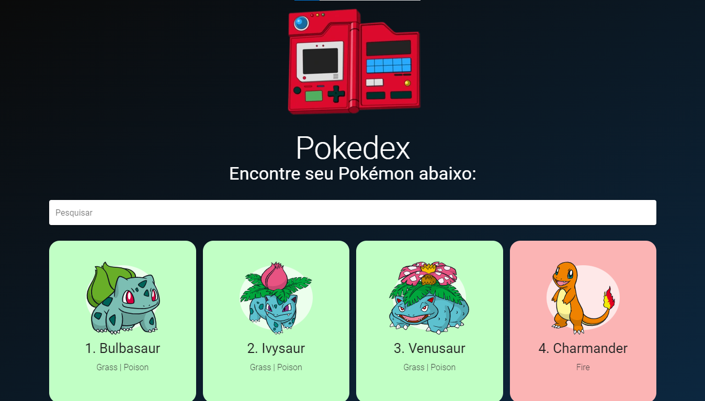

# Pokedex Com Vue.js

A very warm Pokedex for Pokemon fans and Vue.js students.

Made with Vue2 and Vuetify, Pokemons can be listed by _name_ or _number_ and each Pokemon's card color refers to its primary type.

### Links

* Live Site URL: https://subtle-clafoutis-64b2eb.netlify.app/
